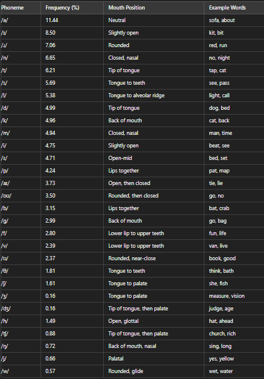
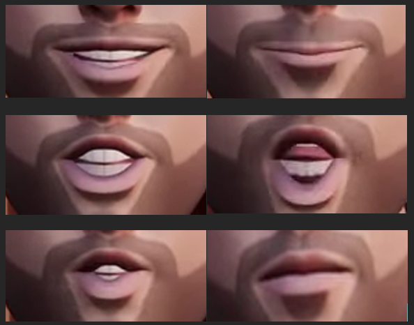

# lipsync-js



## Version

1.0.0

**Note**: This version doesn't work as expected. we are facing an accuracy problem and are working on it.

## Introduction

**lipsync-js** is a powerful library for processing WAV audio files and generating mouth shapes for lip-sync animations. It uses Fast Fourier Transform (FFT) and Short-Time Fourier Transform (STFT) to analyze the audio data and map it to predefined mouth shapes, enabling realistic lip-syncing for animated characters.

## Features

-   **Audio Processing**: Analyzes WAV audio files to extract frequency and magnitude data.
-   **Mouth Shape Mapping**: Maps audio data to mouth shapes based on frequency ranges.

## Installation

Install the library using npm:

```bash
npm install lipsync-js
```

Usage
Example Usage

```js
import processAudioFile from "lipsync-js";

// Accepts only WAV files
async function handleAudioFile(buffer) {
    try {
        // Call the processAudioFile with the WAV buffer
        // and it will return the mouthCues
        const mouthCues = await processAudioFile(buffer);
        console.log(mouthCues);
    } catch (err) {
        console.error("Error processing audio file:", err);
    }
}
```

The processAudioFile function returns an array of mouth cues with start and end times, and the corresponding mouth shape. This can be used to animate 3D avatars on the web.

Example Output:

```js
[
    { start: "0.00", end: "0.05", value: "closed mouth" },
    { start: "0.05", end: "0.27", value: "open mouth" },
    { start: "0.27", end: "0.31", value: "idle position" },
    { start: "0.31", end: "0.43", value: "idle position" },
    { start: "0.43", end: "0.47", value: "idle position" },
];
```



## Community and Contributions

lipsync-js is a community project open to the public. Contributions, feedback, and participation are welcome and encouraged. Together, we can improve and expand the capabilities of this library to benefit everyone.

## Copyright

© 2024 lipsync-js contributors. This project is licensed under the MIT License.

Feel free to let me know if you need any further changes!
