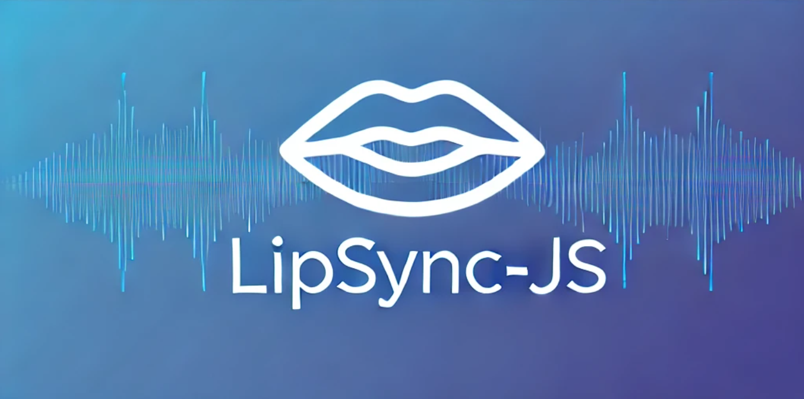

# lipsync-js

**lipsync-js** is a powerful library for processing WAV audio files and generating mouth shapes for lip-sync animations. It uses Fast Fourier Transform (FFT) to analyze the audio data and map it to predefined mouth shapes, enabling realistic lip-syncing for animated characters.

## Features

-   **Audio Processing**: Analyzes WAV audio files to extract frequency and magnitude data.
-   **Mouth Shape Mapping**: Maps audio data to mouth shapes based on frequency ranges.
-   **Smoothing**: Provides smooth transitions between mouth shapes for natural animations.
-   **Customizable**: Allows customization of mouth shape thresholds.

## Phonemes Table

This is a table that shows each phoneme of the English language and their average frequency, mouth position



## Installation

Install the library using npm:

```bash
npm install lipsync-js
```

Usage
Example Usage

```js
const { processAudioFile } = require("lipsync-js");

processAudioFile("path/to/your/audiofile.wav")
    .then((mouthCues) => {
        console.log(mouthCues);
    })
    .catch((err) => {
        console.error("Error processing audio file:", err);
    });
```

Example Output
The processAudioFile function returns an array of mouth cues with start and end times, and the corresponding mouth shape:

```js
[
    { start: "0.00", end: "0.05", value: "closed mouth" },
    { start: "0.05", end: "0.27", value: "open mouth" },
    { start: "0.27", end: "0.31", value: "idle position" },
    { start: "0.31", end: "0.43", value: "idle position" },
    { start: "0.43", end: "0.47", value: "idle position" },
];
```
